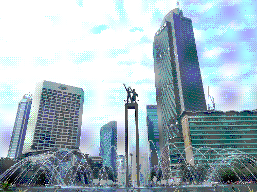

> Jakarta o' Jakarta, how I love to hate you.

## Salam Kenal!

Hello, my name is Dania Rifki, I'm a native of Jakarta, Indonesia, and this is where I will put all my writings about Jakarta on. [You may remember me from that one video about Jakarta's Public Transportation](https://youtu.be/fIZ9c585kf4), this website acts as a spiritual successor to that video. I was originally going to continue *Developing Jakarta*, but it had a few hurdles.

First, I don't have much time nor money to produce a complete polished video like *Developing Jakarta* often. I was lucky that I was able to make it at all, but it just wasn't really sustainable if I do more of it. Plus, Text allows me to publish faster, make corrections easier and to reword sections if I saw fit.

Second, I don't really enjoy being on camera, I'm a transgender woman, and being on camera is really stressful for me; I'm also not that good of a presenter compared to someone like Jay Foreman.

Third, Text allows me to be more personal. You'll notice that I tried shoehorning jokes to the first episode of *Developing Jakarta*, while I never intended it to be popular, it was done so YouTube doesn't bury the video too much. I felt like my direction is controlled by YouTube implicitly; I much rather have a more independent publication that I can count on.

Fourth, Developing Jakarta was focused on city planning. I want to also talk about the city's history, politics, et cetera. However, YouTube's coverage of those genres are incredibly toxic and/or require censoring.

These, along with more smaller reasons are why I started **The Djakartan Dispatch** as an independent website.

## What will *The Dispatch* cover?

Mainly about topics related to the Jakarta Metropolitan Area (Jabodetabek) and Indonesia. This includes, but not limited to: city planning, transportation discussions, housing projects, local history, and current events surrounding the city. I will also talk about Indonesia-wide topics when I feel there's something worth saying about, perhaps I will cover international topics (i.e. Developments in Singapore or San Francisco) at times.

*The Dispatch* will not have a consistent schedule, I will only be writing articles when I feel there is a need to, it is also independent and has no funding, although I hope to start a tip jar in the near future (perhaps something like Ko-Fi).

## In Closing

Thank you for taking the time to read the introduction of **The Djakartan Dispatch**, I hope you will continue to support us in the future, cheers!

Endnote: Feel free to contact the dispatch on thedjakartandispatch `at` protonmail `dot` com. We love getting feedback, we also accept guest post submissions!

\- Dania Rifki
  